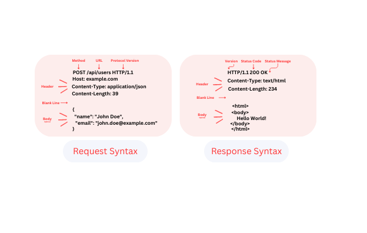

# WEBSERV
<div align="center">

</div>

## Description
This is a teamwork project where we built a small http server designed to handle multiple client requests simultaneously, ensuring efficient and timely responses.

Team : slahrach/mchliyah

## Visual explanation
<p align="center">

</p>
<br> </br>
<p align="center">
</p>
<br> </br>

## Usage

```
# compilation
make
```

```
# Running the server
./webserv [config_file]
```
